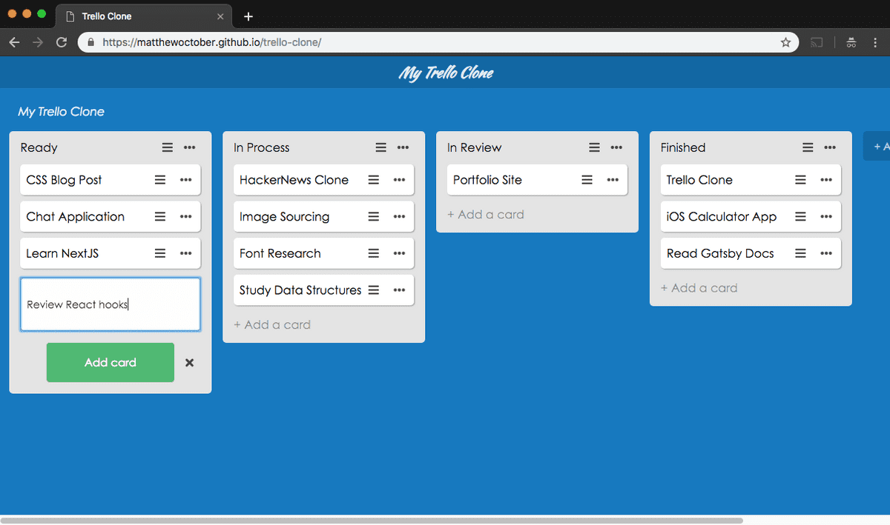

# Trello Clone



I decided to rebuild Trello in order to cement DOM manipulation and event delegation principles.

## Install

Clone this repository:

```bash
git clone https://github.com/matthewoctober/trello-clone.git
```

Change into the appropriate directory:

```bash
cd trello-clone
```

Install all project dependencies:

```bash
npm install
```

Run a development server:

This app doesn't use webpack or any framework that comes with its own development server.
I recommend user a live server plugin (there's literally one called Live Server) to run this application.

